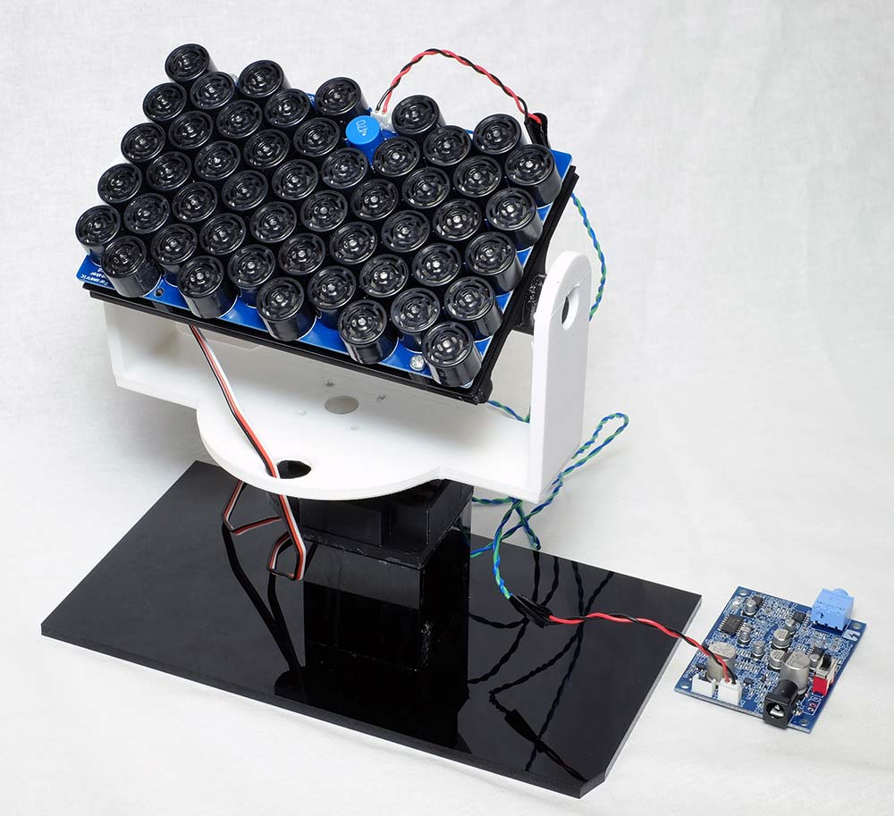
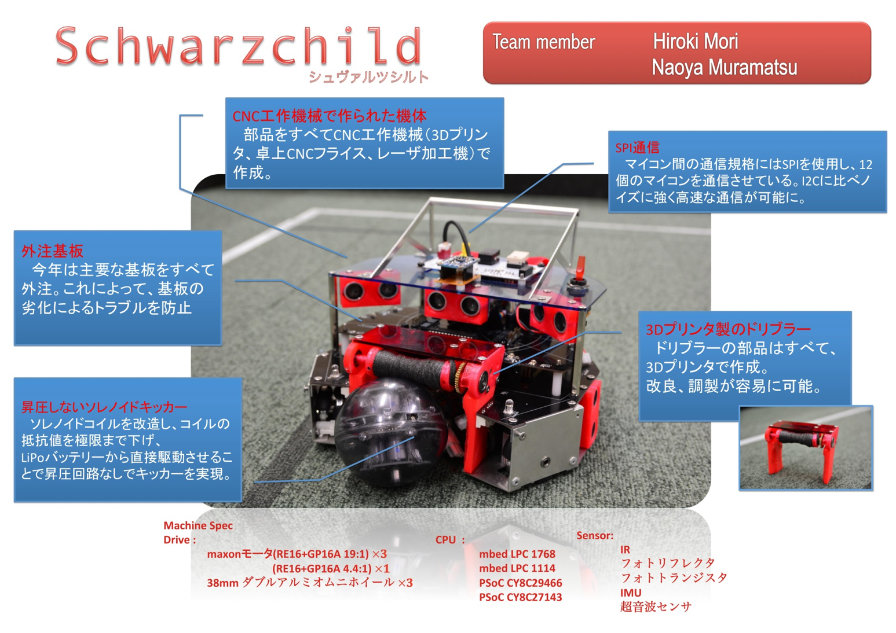
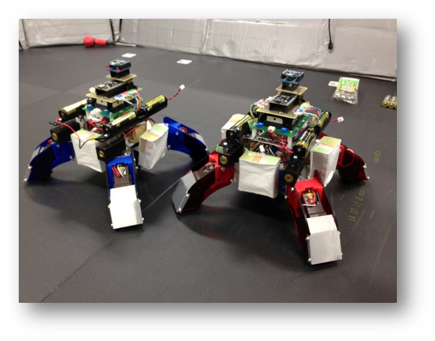

# 村松直哉 / Naoya Muramatsu
University of Tsukuba, School of Informatics  
College of Knowledge and Library Sciences, Science of Informatics  
筑波大学 情報学群 知識情報・図書館学類 4年

[Digital Nature Group (Yoichi Ochiai Lab)デジタルネイチャー研究室（落合陽一研究室）](http://digitalnature.slis.tsukuba.ac.jp/2016/12/naoya-muramatsu/)  
[Pixie Dust Technologies, Inc.ピクシーダストテクノロジーズ株式会社](http://pixiedusttech.com/naoya-muramatsu/)

e-mail: sh.mn.nat [at] gmail.com  
[Twitter: ＠DenDen047](https://twitter.com/DenDen047)  
[Facebook: facebook.com/naoya.muramatsu.98](https://www.facebook.com/naoya.muramatsu.98)  

# Research

## [DeepHolo](http://digitalnature.slis.tsukuba.ac.jp/2017/11/deepholo/)

**Naoya Muramatsu**, Chun Wei Ooi, Yuta Itoh and Yoichi Ochiai  
*SIGGRAPH Asia 2017 Posters*

## [DeepWear](http://digitalnature.slis.tsukuba.ac.jp/2017/09/deepwear/)

Natsumi Kato, Hiroyuki Osone, Daitetsu Sato, **Naoya Muramatsu** and Yoichi Ochiai  
*NIPS 2017 Workshop*

## [Sonoliards](http://digitalnature.slis.tsukuba.ac.jp/2017/10/sonoliards/)

**Naoya Muramatsu**, Kazuki Ohshima, Ryota Kawamura, Ooi Chun Wei, Yuta Sato, Yoichi Ochiai  
*UIST 2017 Demo*

## [RoboCupJunior Soccer 2014/2015](http://www.robocupjunior.jp/)

Hiroki Mori, **Naoya Muramatsu**  
*2015年 北信越ブロック 3位入賞*

# Entertainment

## COJT 9th

# Hobbies

## RobotBattle

> 2015年度の長野高専の文化祭にて展示した企画   
> 2台のロボットがレーザーを撃ち合って戦う．
> ロボットの足にはオムニホイールが使われているため，縦横無尽に移動が出来る．

